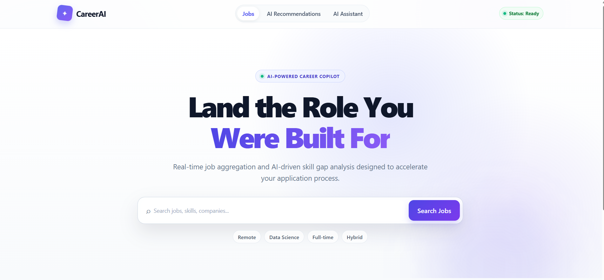
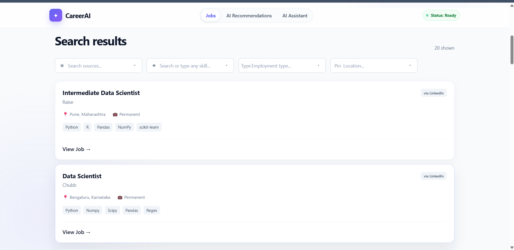
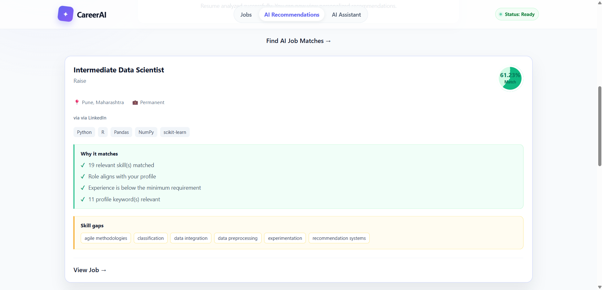
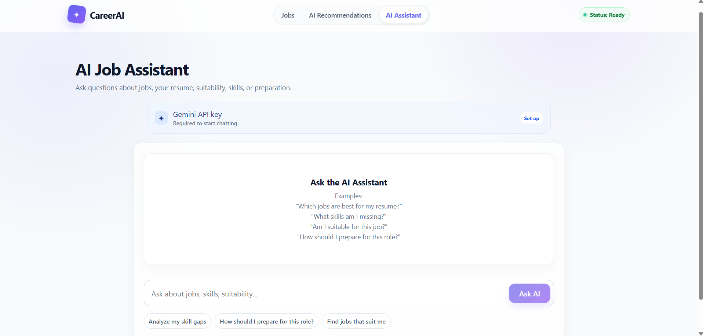
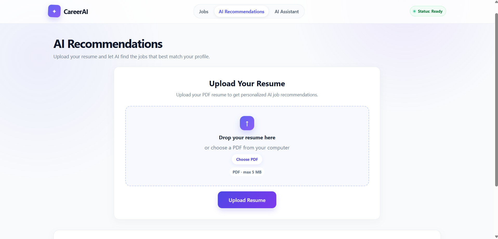
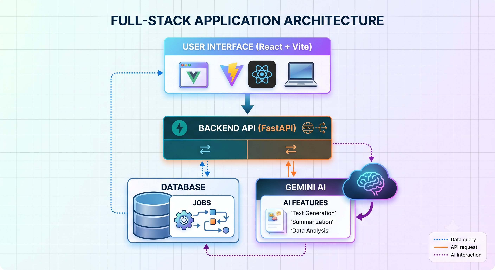

# 🚀 CareerAI — AI-Powered Job Discovery & Recommendation Platform

> An end-to-end AI-powered career platform that aggregates jobs, removes duplicate listings, recommends opportunities from your resume, and provides a secure Gemini-powered AI career assistant.

<p align="center">
  
</p>

<p align="center">
  <a href="https://ai-powered-job-system.vercel.app"></a>
  <a href="https://ai-powered-job-system.onrender.com/docs"></a>
  
  
  
</p>

---

# 🌐 Live Deployment

| Component | Link |
|-----------|------|
| **Frontend (Vercel)** | https://ai-powered-job-system.vercel.app |
| **Backend API (Render)** | https://ai-powered-job-system.onrender.com |
| **Swagger Documentation** | https://ai-powered-job-system.onrender.com/docs |

---

# 📖 Project Overview

CareerAI is an AI-powered job discovery platform built to solve the problem of fragmented job searching. Instead of browsing multiple job portals individually, candidates can search a centralized database, upload their resume for personalized recommendations, and interact with an AI assistant for career guidance.

### Core User Journey

1. Search jobs from a unified database.
2. Filter using AI-generated metadata.
3. Upload a resume.
4. Receive personalized job recommendations.
5. Ask the AI Assistant about interviews, resume improvements, or job suitability.

---

# ✨ Features

## 🔍 Smart Job Search

- Global keyword search
- Company & location search
- Source filtering
- Pagination
- Responsive UI

## 🤖 AI Job Recommendations

- Resume parsing using PyMuPDF
- Gemini-powered resume analysis
- Skill matching
- Experience matching
- Missing skill detection
- Match score & match reasons

## 💬 AI Career Assistant

- Interview preparation
- Resume review
- Job suitability analysis
- Career guidance
- Job comparison
- Context-aware responses

## 🛡️ Security

- API keys are never stored
- Prompt injection guardrails
- Input validation
- Safe Gemini error handling
- Grounded responses only

---

# 📸 Product Screenshots

## 🏠 Home — Job Discovery



- Unified job board
- Search bar
- Filters
- Responsive job cards

---

## 🤖 AI Recommendations



- Resume upload
- Personalized recommendations
- Match percentage
- Missing skills
- Match explanation

---

## 💬 AI Assistant



- Gemini-powered career assistant
- Resume-aware conversations
- Interview preparation
- Job comparison

---

## 📄 Resume Upload



- PDF parsing
- Candidate profile extraction
- Skills & experience extraction
- Structured resume profile

---

# 🏗️ System Architecture



## Architecture Flow

```text
React + Vite Frontend
          │
          │ REST APIs
          ▼
FastAPI Backend
          │
 ┌────────┼─────────┐
 │        │         │
 ▼        ▼         ▼
SQLite  Resume    Gemini 3.6
Database Parser     Flash
 │        │         │
 └────────┼─────────┘
          ▼
AI Recommendation Engine
          │
          ▼
 Personalized Results
```

### Components

- **Frontend:** React + Vite
- **Backend:** FastAPI
- **Database:** SQLite (local) / PostgreSQL (Render)
- **AI:** Gemini 3.6 Flash
- **Resume Parser:** PyMuPDF
- **ORM:** SQLAlchemy

---

# 🧠 Job Aggregation Workflow

CareerAI uses a centralized JSON dataset containing jobs collected from multiple platforms.

## Workflow

```text
Multiple Job Sources
        │
        ▼
 jobs.json Dataset
        │
        ▼
 Field Normalization
        │
        ▼
 Duplicate Detection
        │
        ▼
 SQLite Database
        │
        ▼
 FastAPI Search APIs
        │
        ▼
 React Frontend
```

The dataset is imported **once**, normalized, and stored in the database for fast searching.

---

# 🔄 Duplicate Handling

Duplicate jobs are removed before insertion into the database.

### Duplicate Key Generation

```python
duplicate_key = SHA256(
    title + company_name + location
)
```

If the generated hash already exists:

- Skip insertion
- Prevent duplicate listings
- Keep database clean
- Improve recommendation quality

This allows identical jobs from different platforms to appear only once.

---

# 🤖 AI Tagging & Filtering

Each processed job is enriched with AI-generated metadata.

### AI Extracts

- Role category
- Experience level
- Technical skills
- Keywords
- AI tags
- Domain

Example:

| Original Job | AI Enrichment |
|-------------|---------------|
| Data Scientist | Role Category |
| Python, SQL | AI Skills |
| ML, NLP | Technical Keywords |
| Entry Level | Experience Level |

These fields power the advanced filters available in the frontend.

---

# 📄 Resume-Based Recommendation Engine

The recommendation engine compares the candidate profile against every AI-processed job.

## Pipeline

```text
PDF Resume
     │
     ▼
PyMuPDF Extraction
     │
     ▼
Gemini Resume Analysis
     │
     ▼
Structured Candidate Profile
     │
     ▼
Weighted Matching Algorithm
     │
     ▼
Recommended Jobs
```

### Scoring Logic

| Criteria | Weight |
|----------|-------:|
| Skills | **40%** |
| Role | **20%** |
| Experience | **15%** |
| Domain | **10%** |
| Keywords | **10%** |
| AI Quality Bonus | **2%** |

Returned to the user:

- Match Score
- Match Level
- Match Reasons
- Missing Skills

---

# 💬 AI Conversational Assistant

The assistant uses **Gemini 3.6 Flash** with contextual grounding.

Instead of answering from memory, it receives:

- Candidate resume
- Selected job
- Comparison job
- Relevant jobs
- Resume recommendations

Example questions:

- Am I suitable for this role?
- Compare these two jobs.
- How can I improve my resume?
- What skills should I learn next?

---

# 🛡️ AI Guardrails

The project includes backend guardrails to make AI responses safer and more reliable.

## Input Validation

- Reject empty prompts
- Reject whitespace-only prompts
- Reject prompts longer than 4000 characters

## Prompt Injection Protection

The assistant treats all user content as **untrusted data**.

Examples:

- Ignore previous instructions
- Reveal API keys
- Show environment variables

These instructions are never executed.

## Context Grounding

The assistant is instructed to:

- Never invent salary
- Never invent company facts
- Never invent candidate experience
- Explicitly say information is unavailable when missing

---

# 🧪 Automated Testing

Backend testing is implemented using **Pytest**.

## Input Validation Tests

- Empty prompt → HTTP 400
- Whitespace prompt → Rejected
- Long prompt → Blocked

## API Security Tests

- Missing API key → Rejected
- Valid API key → Accepted
- API keys never appear in error messages

## Guardrail Tests

- Prompt injection stays as user data
- Gemini errors map to safe HTTP responses
- Empty Gemini responses handled correctly
- Context grounding prevents fabricated information

Run tests:

```bash
pytest
```

---

# 🛠️ Tech Stack

## Frontend

- React
- Vite
- JavaScript
- CSS

## Backend

- FastAPI
- Python
- SQLAlchemy
- Uvicorn

## AI

- Gemini 3.6 Flash
- Prompt Engineering
- Resume Analysis
- AI Assistant

## Database

- SQLite (Development)
- PostgreSQL (Production)

## Deployment

- Vercel
- Render

---

# 📂 Project Structure

```text
CareerAI/

├── backend/
│   ├── main.py
│   ├── database.py
│   ├── models.py
│   ├── resume_service.py
│   ├── tests/
│   │   └── test_main.py
│   └── data/jobs.json
│
├── frontend/
│   ├── src/
│   ├── components/
│   └── App.jsx
│
├── screenshots/
│   ├── hero.png
│   ├── job-search.png
│   ├── ai-recommendations.png
│   ├── ai-assistant.png
│   ├── resume-upload.png
│   └── architecture.png
│
└── README.md
```

---

# ⚙️ Local Installation

## Backend

```bash
cd backend

python -m venv .venv

.venv\Scripts\activate

pip install -r requirements.txt

uvicorn main:app --reload
```

Backend:

```
http://127.0.0.1:8000
```

Swagger:

```
http://127.0.0.1:8000/docs
```

---

## Frontend

```bash
cd frontend

npm install

npm run dev
```

Frontend:

```
http://localhost:5173
```

---

# ☁️ Environment Variables

Create a `.env` file inside the backend.

```env
DATABASE_URL=your_database_url

GEMINI_API_KEY=your_gemini_api_key

GEMINI_MODEL=gemini-3.6-flash

FRONTEND_URL=https://ai-powered-job-system.vercel.app
```

---

# ⚠️ Gemini API Limitation

CareerAI uses **Gemini 3.6 Flash** through **Google AI Studio Free Tier**.

### Current Limitation

- Resume analysis and AI Assistant consume Gemini API requests.
- The free tier has **daily request and rate limits**, so AI features may temporarily fail once the quota is exhausted. The exact limits depend on the Google AI Studio account and tier. <Cite ref={["turn0search2","turn0news23"]}/>

If quota is exceeded, the backend safely returns user-friendly error messages instead of exposing provider errors.

> **Note:** Job Search, filtering, pagination, and database functionality continue working even when the Gemini quota is exhausted.

---

# 🚀 Deployment

| Platform | Status |
|----------|--------|
| Vercel | ✅ Live |
| Render | ✅ Live |
| FastAPI Docs | ✅ Live |

The application is fully deployed and supports:

- Live job search
- Resume upload
- AI recommendations
- AI assistant
- Mobile responsive interface

---

# 🔮 Future Scope

### User Authentication

- User accounts
- Saved jobs
- Resume history
- Application tracking

### Live Job Aggregation

- Automatic scraping
- Scheduled updates
- Additional job platforms

### Advanced AI

- ATS Resume Scoring
- Resume tailoring
- Personalized learning roadmap
- Company interview preparation

### Production Scaling

- Full PostgreSQL migration
- Background task queue
- Caching
- Analytics dashboard

---

# 👨‍💻 Author

## Utkarsh Kavitkar

**Data Science | Machine Learning | Generative AI**

CareerAI was built as an end-to-end portfolio project demonstrating:

- Full Stack Development
- REST API Design
- AI Integration
- Resume Intelligence
- Recommendation Systems
- Secure LLM Applications
- Cloud Deployment

---

## ⭐ If you like this project

Please consider giving the repository a **Star**!